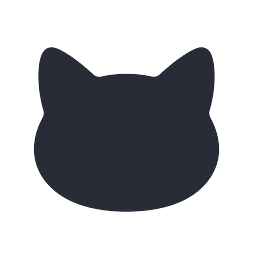

<p align="center"></p>

# Meowcast

A free, open-source desktop launcher with a cat companion. Meowcast is a Windows-focused alternative to Raycast: find your apps, keep reusable text close, and connect your own AI tools.

This is an early Windows preview. The source is available to study, change and build. AI providers set their own subscription limits and API prices. An AI subscription is not included.

## What's here

- **Launcher:** keyboard search, favorite items, usage ordering and customizable settings. Default shortcut: Alt + Space.
- **Everyday tools:** notes, text snippets, clipboard history and an offline whiteboard.
- **Text studio:** editable AI actions, offline Prompt Master, supported subscription clients and API connections.
- **Meowmate:** a cat dock with Codex chat, model selection and project tasks. Project tasks can modify the selected folder and run commands.
- **Images:** offline prompt preparation and a local reference preview, with a browser handoff to Gemini. Automatic Gemini generation is not implemented.
- **Appearance:** customizable light and dark themes, with an option to follow the system setting.

Codex chat and project-task execution have returned real test responses using a signed-in ChatGPT account. Other connections depend on the installed client, account permissions and provider behavior. A configured provider does not mean its connection has been tested. There is no silent fallback from a subscription to a paid API.

## Build on Windows

Requirements: Node.js 22 or newer, npm, Rust stable with the Windows MSVC target, Visual Studio C++ Build Tools, and WebView2 Runtime. Use the official Codex client and its normal login if you want subscription chat. Keep credentials in the app's supported secure settings or official client. Never put them in this repository.

```powershell
powershell -NoProfile -ExecutionPolicy Bypass -File scripts/build-windows.ps1
```

This builds Meowmate, stages it into the launcher and produces the Windows installer and portable ZIP under `app/release`. The build is unsigned unless you configure your own signing certificate. No signing keys or personal profiles are included.

To work on just the launcher:

```powershell
cd app
npm ci
npm run dev
```

For the companion source and its build details, see [meowmate](meowmate/README.md).

## Make it yours

| Change | Source |
| --- | --- |
| Launcher layout and settings | `app/src/renderer` |
| Search, actions and integrations | `app/src/main` |
| Shared types and defaults | `app/src/common` |
| Companion interface and cat | `meowmate/src` |
| Companion native commands | `meowmate/src-tauri` |
| Product website | `website` |

Run `npm run check` and `npm run build` in `app` before packaging. The companion has TypeScript and Rust checks plus Node tests. Tests that mock a browser or provider do not establish native desktop or live AI behavior.

## Current limits

Windows is the tested development platform. macOS launcher build configuration is included, but a native Mac release and Mac companion integration have not been accepted. Cloud sync and multi-app window layouts are not implemented. Voice dictation is outside this preview. Gemini Images still requires you to paste the prompt and attach the reference in the browser.

The apps preserve their original internal identifiers for existing local data. Meowcast's internal package name is `hustlecmd`. The companion's internal executable is `coucou.exe`. These identifiers are not the product names.

## License and attribution

Application code is MIT licensed. Meowcast builds on [Ueli](https://github.com/oliverschwendener/ueli), by Oliver Schwendener. Meowmate's infrastructure builds on [Coucou](https://github.com/Louis-CFM/coucou), by Louis Raillé. Original license notices are retained.

The public companion uses original cat artwork and its own small animation implementation. Upstream Coucou/Mochi characters, sounds, promotional media and icons are excluded. Third-party names and logos identify their respective tools. This project is not affiliated with Raycast, OpenAI, Google, Anthropic or Cursor.

See [LICENSE](LICENSE), [app/LICENSE](app/LICENSE), and the companion's license notices. Please do not include credentials, personal conversations or project contents in issues.
